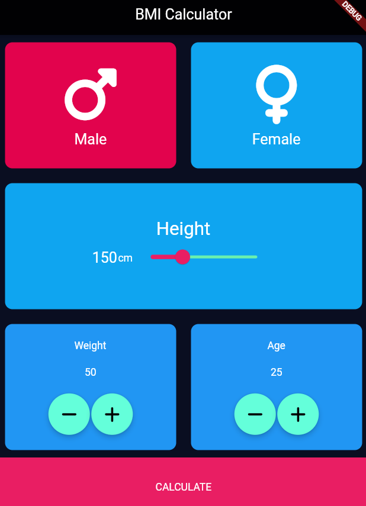

# bmi_calculator_flutter
BMI  calculator Flutter  app

<h5>Theme Data</h5>
<pre>

https://api.flutter.dev/flutter/material/ThemeData-class.html

    return MaterialApp(
    
      theme: ThemeData.dark(),
      home: Scaffold(),

    );

     theme: ThemeData(
        appBarTheme: const AppBarTheme(backgroundColor: Colors.brown),
      ),

    //custom Hex color
     theme: ThemeData(
        //0xFF - fully opaque color , #EEEEEE from color picker hexa
        primaryColor: const Color(0xFFEEEEEE),

        
        /*
        Color c1 = const Color(0xFF42A5F5);
        Color c2 = const Color.fromARGB(0xFF, 0x42, 0xA5, 0xF5);
        Color c3 = const Color.fromARGB(255, 66, 165, 245);
        Color c4 = const Color.fromRGBO(66, 165, 245, 1.0); 
        */

      ),    

    //default darktheme has white color for text in the body
    theme: ThemeData.dark().copyWith(
        appBarTheme: const AppBarTheme(backgroundColor: Colors.black87),
        primaryColor: const Color(0xFF0A0E21),
        scaffoldBackgroundColor: const Color(0xFF0A0E21),
    ),

//even the theme is dark for overall app
//we can tap into to the control by wrapping them with widget theme 
//which has data propery.

    floatingActionButton: Theme(
        data: ThemeData(
          hoverColor: Colors.green,
        ),

        child: FloatingActionButton(
          child: const Icon(Icons.add),
          onPressed: () {
            //
          },
        ),
      ),
</pre>

<h5>Extracting And Refactoring Widgets</h5>
<pre>
    Column

        expanded(Row( 2 expanded( 2 conatiner ( ) ) ) ),

        expanded( 1 conatiner() ),

        expanded(Row( 2 expanded( 2 conatiner ( ) ) ) ),

        Container(
                 margin: const EdgeInsets.all(10.0),
                 decoration: BoxDecoration(
                        color: Colors.black54,
                        borderRadius: BorderRadius.circular(10.0),
                    ),
                ),
</pre>

<h5> Reusing the conatiners </h5>
<pre>
    Extract the widget , here the container
    Give it a name.

    ReusableCard(), in the place of container(),

    class ReusableCard extends StatelessWidget {
    const ReusableCard({
        super.key,
    });

    @override
    Widget build(BuildContext context) {
        return Container(
        margin: const EdgeInsets.all(10.0),
        decoration: BoxDecoration(
            color: Colors.black54,
            borderRadius: BorderRadius.circular(10.0),
        ),
        );
    }
    }

A Key is an identifier for Widgets, Elements and SemanticsNodes.

A new widget will only be used to update an existing element if its key is the same as the key of the current widget associated with the element.

</pre>

<h5> Passing Color Parameter </h5>
<pre>

    ReusableCard(colour: Colors.blue),

    //this one used without key
ReusableCard({required this.colour});

    //with key, since its stateless widget  super.key is preffered
const ReusableCard({super.key, required this.colour});

    //all stateless widgets mostly 
    final Color colour;

    decoration: BoxDecoration(
            color: colour,
            borderRadius: BorderRadius.circular(10.0),
        ),
</pre>

<h5>const vs final</h5>
<pre>
Both are immutable.
const before run time. [ most widgets size,shape,height, width ... before the ui is compiled ]
final run time we can pass data.
</pre>

<h5> Passing widgets in the constructor</h5>
<pre>
        ReusableCard(
           colour: Colors.blue,
           genderCard: IconContent(
             genderText: 'Female',
             genderIcon: FontAwesomeIcons.venus,
          ),),

        const IconContent({
            super.key,
            required this.genderText,
            required this.genderIcon,
        });

        final String genderText;
        final IconData genderIcon;

//entire children widgets extracted and we are passing an widget genderIcon

    return Column(
      mainAxisAlignment: MainAxisAlignment.center,
      children: [
        Icon(
          genderIcon,
          size: 80,
        ),
        const SizedBox(
          height: 10,
        ),
        Text(
          genderText,
          style: const TextStyle(fontSize: 20),
        )
      ],
    );

</pre>

<h5> Passing functions as parameter </h5>

<pre>

    int Calculator(int a, int b, Function myFunc() )
    {
      return myFunc(a,b);
    }

    Calculator(5,6, multiply);

    Calculator(5,6, add);

</pre>

<h5>INT to STRING</h5>

<pre>
  int heightUser = 180;

  //to display string in Text()
  heightUser.toString(),

</pre>
<h5> Slider </h5>
<pre>

      Slider(
          value: heightUser.toDouble(),
          min: 120,
          max: 220,
          activeColor: Colors.pink,
          inactiveColor: Colors.greenAccent,
          onChanged: (valuesFromTheCursor) {
            setState(() {
              heightUser = valuesFromTheCursor.toInt();
            });
          }),
</pre>

<h5>Extending widget with custom properties</h5>
<pre>
  create stateless widget
  Name it
  return actual widget with custom properties 
</pre>

<h5>Navigation </h5>
<pre>
https://docs.flutter.dev/cookbook/navigation/navigation-basics
https://docs.flutter.dev/ui/navigation

      onPressed: () {
        Navigator.push(
          context, //current context
          MaterialPageRoute(builder: (context) => const SecondRoute()), //SecondRoute stless/steful widget name
        );
      }

      //go back
      onPressed: () {
        Navigator.pop(context);
      },
</pre>

<h5>Create seperate class to calculate BMI</h5>
<pre>
 
1. import the class bmi_Class.dart

2. call the class to an object

3. pass the obj on NAVIGATOR PUSH to other route widget  

        import 'dart:math';

        class BMICalculator {

        //constructor
             BMICalculator({ required this.height, required this.weight });

          final int height;
          final int weight;
          
        //either late or privide a initial value

            late double bmi;
            //double bmi = 0;

          String findBMI() {
            bmi = weight / pow(height / 100, 2);
            return bmi.toStringAsFixed(2);
          }

          String condition() {
            if (bmi > 25) {
              return 'Over Weight';
            } else if (bmi > 18) {
              return 'Normal';
            } else {
              return 'Under Weight';
            }
          }
        }

In the Screen which receives the input

    class FinalResult extends StatelessWidget {
      const FinalResult({
        super.key,      
        required this.userCondition,   //this  ->  final String userCondition
        required this.userBMI,    //this ->   final String userBMI;
      });

      final String userCondition;
      final String userBMI;

      Widget build(BuildContext context) {
        return Scaffold( Text(userCondition),Text(userBMI) );
      }
    }

Screen Which passes the input

              onTap: () {

                //import the class
                //call the class to userBMI
                //since class requires height and weight, pass the values

                BMICalculator userBMI =
                    BMICalculator(height: heightUser, weight: startWeight);

                Navigator.push(
                  context,
                  MaterialPageRoute(builder: (context) {

                    //Receiver Screen Widget Name
                    //Since receiver widget build method requires  userBMI & userCondition (refer prev code block)
                    //pass the data calculated from class object 
                    
                      return FinalResult(
                        userBMI: userBMI.findBMI(),
                        userCondition: userBMI.condition(),
                      );

                  }),
                );
              },

</pre>

<h5>Result</h5>

